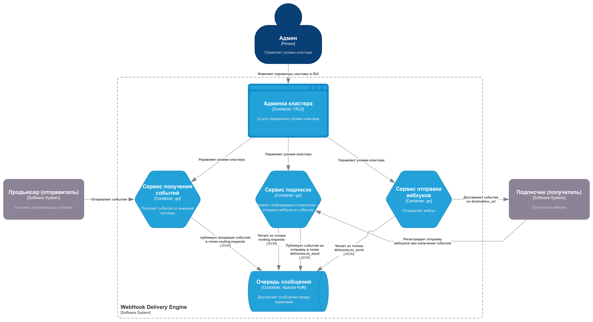

# Архитектура системы доставки вебхуков "WebHook Delivery Engine"

[ссылка на редактирование][edit-c4-arch]

[edit-c4-arch]: https://app.diagrams.net/#Hdws-1-2026-green%252Fwiki%252Fmain%252Fdocs%252Fresources%252Fc4-arch.drawio

## Диаграмма контектса системы: C4 Context

Здесь представлено общее видение системы в контексте взаимодействия с внешними системами.

## Диаграмма контейнеров системы: C4 Container

Здесь представлено общее видение системы в виде обособленных взаимодействующих элементов системы.

