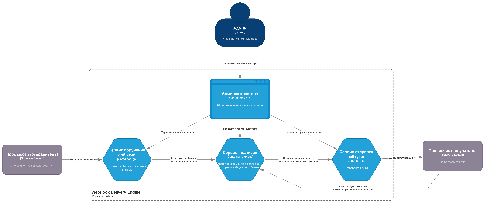

# Архитектура системы доставки вебхуков "WebHook Delivery Engine"

## Диаграмма контектса системы: C4 Context

Здесь представлено общее видение системы в контексте взаимодействия с внешними системами ([ссылка на редактирование][edit-c4-context]).

[edit-c4-context]: https://app.diagrams.net/?mode=github#Hdws-1-2026-green%2Fwiki%2Fc4-context%2Fdocs%2Fresources%2Fc4-context.drawio#%7B%22pageId%22%3A%22f5pJxBR4R1o1dGo88Nnl%22%7D

## Диаграмма контейнеров системы: C4 Container

Здесь представлено общее видение системы в виде обособленных взаимодействующих элементов системы ([ссылка на редактирование][edit-c4-container]).

[edit-c4-container]: https://app.diagrams.net/?mode=github#Hdws-1-2026-green%2Fwiki%2Fc4-container%2Fdocs%2Fresources%2Fc4-container.drawio#%7B%22pageId%22%3A%221Usoh1T5NGmHRIUC36LT%22%7D
