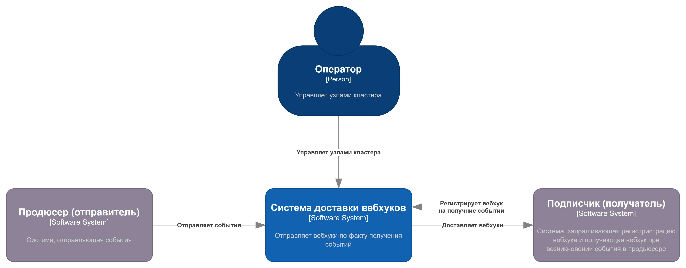

# Архитектура системы доставки вебхуков "WebHook Delivery Engine"

## Диаграмма контектса системы: C4 Context

Здесь представлено общее видение системы в контексте взаимодействия с внешними системами ([ссылка на редактирование][edit-c4-context]).

[edit-c4-context]: https://app.diagrams.net/?src=about#Hdws-1-2026-green%2Fwiki%2Fmain%2Fdocs%2Fresources%2Fc4-context.drawio

## Диаграмма контейнеров системы: C4 Container

Здесь представлено общее видение системы в виде обособленных взаимодействующих элементов системы ([ссылка на редактирование][edit-c4-container]).

[edit-c4-container]: https://app.diagrams.net/?src=about#Hdws-1-2026-green%2Fwiki%2Fmain%2Fdocs%2Fresources%2Fc4-container.drawio
