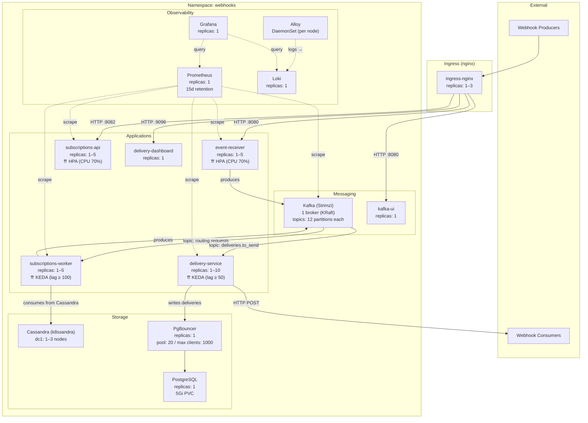

# Deployment Diagram



## Scaling Summary

| Service | Type | Min | Max | Trigger | Behavior |
|---------|------|-----|-----|---------|----------|
| event-receiver | HPA | 1 | 5 | CPU 70% | scale up +2/30s, scale down -1/60s |
| subscriptions-api | HPA | 1 | 5 | CPU 70% | scale up +2/30s, scale down -1/60s |
| subscriptions-worker | KEDA | 1 | 5 | Kafka lag ≥ 100 on `routing.requests` | cooldown 120s |
| delivery-service | KEDA | 1 | 10 | Kafka lag ≥ 50 on `deliveries.to_send` | cooldown 120s |

## Data Flow

```
External Events → event-receiver → Kafka(routing.requests) → subscriptions-worker → Kafka(deliveries.to_send) → delivery-service → External URLs
                                         ↑ reads subscriptions from Cassandra                ↑ writes delivery status to PostgreSQL via PgBouncer
```
